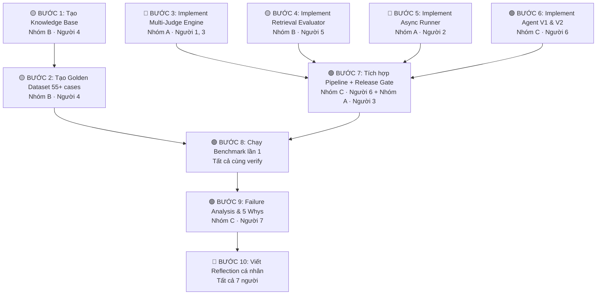

# 👥 Phân Công Công Việc Lab 14 — Nhóm 7 Người

## Tổng Quan Phân Nhóm

```
┌─────────────────────────────────────────────────────────┐
│  NHÓM A (3 người) — Eval Engine & Multi-Judge           │
│  ⭐ Phần NẶng nhất, chiếm 25/60 điểm nhóm              │
│  → Người 1, Người 2, Người 3                            │
├─────────────────────────────────────────────────────────┤
│  NHÓM B (2 người) — Dataset & Retrieval Eval            │
│  📊 Phần NỀN TẢNG, chiếm 20/60 điểm nhóm              │
│  → Người 4, Người 5                                     │
├─────────────────────────────────────────────────────────┤
│  NHÓM C (2 người) — Regression, Analysis & Reports      │
│  📝 Phần TỔNG HỢP, chiếm 15/60 điểm nhóm              │
│  → Người 6, Người 7                                     │
└─────────────────────────────────────────────────────────┘
```

---

## 🔴 NHÓM A: Eval Engine & Multi-Judge (3 người)

> **Điểm liên quan:** Multi-Judge (15đ) + Performance Async (10đ) = **25 điểm**
> **Độ khó:** ⭐⭐⭐⭐⭐ — Nhiều code phức tạp, cần hiểu API, async, consensus logic

### Người 1 — Multi-Judge Core

| Việc cần làm | File | Chi tiết |
|---|---|---|
| Implement logic gọi 2+ Judge models | `engine/llm_judge.py` | Hàm `_call_openai_judge`, `_call_anthropic_judge` |
| Viết rubrics đánh giá chi tiết | `engine/llm_judge.py` | `EVAL_RUBRICS` (accuracy, professionalism, safety) |
| Xử lý conflict khi 2 Judge lệch > 1 điểm | `engine/llm_judge.py` | Gọi Judge thứ 3, lấy median |
| Tính Agreement Rate | `engine/llm_judge.py` | Hàm `evaluate_multi_judge` |

**Cần giải thích được:** Cohen's Kappa, Agreement Rate, tại sao cần ≥ 2 Judge.

### Người 2 — Async Runner & Performance

| Việc cần làm | File | Chi tiết |
|---|---|---|
| Tối ưu Runner chạy song song | `engine/runner.py` | `asyncio.gather`, batch processing |
| Đảm bảo pipeline < 2 phút cho 55 cases | `engine/runner.py` | Tuning `batch_size` |
| Tạo Performance Report | `engine/runner.py` | Latency P50/P95, throughput |
| Báo cáo Cost & Token usage | `engine/llm_judge.py` | Hàm `get_cost_report` |

**Cần giải thích được:** Tại sao dùng async, cách tính throughput, trade-off batch_size.

### Người 3 — Position Bias & Nâng Cao

| Việc cần làm | File | Chi tiết |
|---|---|---|
| Implement Position Bias check | `engine/llm_judge.py` | Hàm `check_position_bias` |
| Implement Simulation Mode | `engine/llm_judge.py` | Hàm `_simulate_score` |
| Hỗ trợ Người 1 test Multi-Judge | `engine/llm_judge.py` | Edge cases cho Judge |
| Tích hợp Judge vào `main.py` | `main.py` | Kết nối `LLMJudge` class thật vào pipeline |

**Cần giải thích được:** Position Bias là gì, cách detect, tại sao Judge có thiên vị.

---

## 🟡 NHÓM B: Dataset & Retrieval Eval (2 người)

> **Điểm liên quan:** Retrieval Eval (10đ) + Dataset SDG (10đ) = **20 điểm**
> **Độ khó:** ⭐⭐⭐ — Cần tỉ mỉ, hiểu RAG pipeline

### Người 4 — Golden Dataset & SDG

| Việc cần làm | File | Chi tiết |
|---|---|---|
| Thiết kế Knowledge Base (15 documents) | `data/synthetic_gen.py` | Dict `KNOWLEDGE_BASE` |
| Tạo 55+ test cases đa dạng | `data/synthetic_gen.py` | Easy/Medium/Hard/Adversarial/Edge |
| Thiết kế Red Teaming cases | `data/synthetic_gen.py` | Prompt injection, goal hijacking |
| Tham khảo & bổ sung Hard Cases | `data/HARD_CASES_GUIDE.md` | Đảm bảo đủ loại adversarial |

**Cần giải thích được:** Tại sao cần adversarial cases, cách thiết kế Golden Dataset chất lượng.

### Người 5 — Retrieval Evaluation

| Việc cần làm | File | Chi tiết |
|---|---|---|
| Implement Hit Rate & MRR | `engine/retrieval_eval.py` | `calculate_hit_rate`, `calculate_mrr` |
| Thêm Precision@K & Recall@K | `engine/retrieval_eval.py` | Metrics bổ sung |
| Implement RAGAS metrics | `engine/retrieval_eval.py` | Faithfulness, Relevancy |
| Nâng cấp Agent retrieval simulation | `agent/main_agent.py` | Hàm `_retrieve` |

**Cần giải thích được:** MRR là gì, tại sao đánh giá Retrieval trước Generation, Hit Rate vs Precision.

---

## 🟢 NHÓM C: Regression, Analysis & Reports (2 người)

> **Điểm liên quan:** Regression (10đ) + Failure Analysis (5đ) = **15 điểm**
> **Độ khó:** ⭐⭐⭐ — Cần phân tích, viết báo cáo sâu

### Người 6 — Regression & Release Gate

| Việc cần làm | File | Chi tiết |
|---|---|---|
| Tạo 2 phiên bản Agent (V1/V2) | `agent/main_agent.py` | Class `MainAgent(version)` |
| Implement Release Gate logic | `main.py` | Hàm `release_decision` |
| Tích hợp pipeline hoàn chỉnh | `main.py` | Kết nối tất cả module |
| Chạy benchmark & xuất reports | `main.py` | `reports/summary.json`, `benchmark_results.json` |

**Cần giải thích được:** Regression testing là gì, các tiêu chí Release Gate, Delta Analysis.

### Người 7 — Failure Analysis & Reports

| Việc cần làm | File | Chi tiết |
|---|---|---|
| Phân nhóm lỗi (Failure Clustering) | `analysis/failure_analysis.md` | Section 2: bảng phân loại lỗi |
| Phân tích 5 Whys (3 case tệ nhất) | `analysis/failure_analysis.md` | Section 3: chuỗi nguyên nhân |
| Viết Action Plan cải tiến | `analysis/failure_analysis.md` | Section 4: kế hoạch khắc phục |
| Thu thập Reflections cá nhân | `analysis/reflections/` | Nhắc mọi người viết reflection |

**Cần giải thích được:** Phương pháp 5 Whys, Root Cause Analysis, lỗi nằm ở pipeline nào.

---

## 📋 Việc CHUNG Mỗi Người Đều Phải Làm

| Việc | File | Ghi chú |
|---|---|---|
| ✍️ Viết Reflection cá nhân | `analysis/reflections/reflection_[Tên].md` | **Bắt buộc** — 40 điểm cá nhân |
| 💻 Có Git commits riêng | — | Chứng minh đóng góp qua commit history |
| 🧠 Giải thích được phần mình làm | — | Phỏng vấn kỹ thuật: MRR, Cohen's Kappa, Position Bias... |

---

## 🔗 Thứ Tự Thực Hiện Theo Pipeline

### Sơ đồ Pipeline tổng thể



### Chi tiết từng bước Pipeline

> [!NOTE]
> **Bước 1→2** phải xong TRƯỚC vì tất cả bước sau phụ thuộc vào data. **Bước 3, 4, 5, 6** có thể làm SONG SONG. **Bước 7→8→9→10** phải làm TUẦN TỰ.

---

#### 🟡 BƯỚC 1 — Tạo Knowledge Base `[Nhóm B · Người 4]`
| | |
|---|---|
| **File** | `data/synthetic_gen.py` → Dict `KNOWLEDGE_BASE` |
| **Output** | 15 tài liệu mô phỏng (policy, FAQ, hướng dẫn...) |
| **Thời gian** | 15 phút |
| **Blocking** | ⛔ Bước 2, 6 phụ thuộc vào Knowledge Base |

---

#### 🟡 BƯỚC 2 — Tạo Golden Dataset `[Nhóm B · Người 4]`
| | |
|---|---|
| **File** | `data/synthetic_gen.py` → Hàm `build_golden_dataset()` |
| **Chạy** | `python data/synthetic_gen.py` |
| **Output** | `data/golden_set.jsonl` (55+ test cases) |
| **Thời gian** | 30 phút |
| **Blocking** | ⛔ Bước 8 (Benchmark) không chạy được nếu chưa có file này |

---

#### 🔴 BƯỚC 3 — Implement Multi-Judge Engine `[Nhóm A · Người 1 + Người 3]` ⚡ Song song với Bước 4, 5, 6
| | |
|---|---|
| **File** | `engine/llm_judge.py` |
| **Output** | Class `LLMJudge` với `evaluate_multi_judge()` trả về `final_score`, `agreement_rate` |
| **Thời gian** | 60-90 phút |
| **Blocking** | ⛔ Bước 7 cần Judge hoạt động để tích hợp |
| **Lưu ý** | Người 1 lo core logic, Người 3 lo simulation mode + position bias |

---

#### 🟡 BƯỚC 4 — Implement Retrieval Evaluator `[Nhóm B · Người 5]` ⚡ Song song với Bước 3, 5, 6
| | |
|---|---|
| **File** | `engine/retrieval_eval.py` |
| **Output** | Class `RetrievalEvaluator` với `score()` trả về `hit_rate`, `mrr`, `faithfulness`, `relevancy` |
| **Thời gian** | 45-60 phút |
| **Blocking** | ⛔ Bước 7 cần Evaluator để tích hợp |

---

#### 🔴 BƯỚC 5 — Implement Async Runner `[Nhóm A · Người 2]` ⚡ Song song với Bước 3, 4, 6
| | |
|---|---|
| **File** | `engine/runner.py` |
| **Output** | Class `BenchmarkRunner` với `run_all()` chạy async, `get_performance_report()` |
| **Thời gian** | 45 phút |
| **Blocking** | ⛔ Bước 7 cần Runner để ghép pipeline |

---

#### 🟢 BƯỚC 6 — Implement Agent V1 & V2 `[Nhóm C · Người 6]` ⚡ Song song với Bước 3, 4, 5
| | |
|---|---|
| **File** | `agent/main_agent.py` |
| **Output** | Class `MainAgent(version="v1"/"v2")` với RAG retrieval simulation |
| **Thời gian** | 30-45 phút |
| **Phụ thuộc** | Cần Knowledge Base từ Bước 1 |
| **Blocking** | ⛔ Bước 7 cần Agent để chạy Benchmark |

---

#### 🟢 BƯỚC 7 — Tích hợp Pipeline + Release Gate `[Nhóm C · Người 6 + Nhóm A · Người 3]`
| | |
|---|---|
| **File** | `main.py` |
| **Input cần** | Agent (Bước 6) + Evaluator (Bước 4) + Judge (Bước 3) + Runner (Bước 5) |
| **Output** | Hàm `main()` hoàn chỉnh + `release_decision()` |
| **Thời gian** | 30 phút |
| **Blocking** | ⛔ PHẢI CHỜ Bước 3, 4, 5, 6 hoàn thành |

> [!WARNING]
> Đây là **điểm hội tụ** — tất cả các module phải sẵn sàng. Người 6 (Nhóm C) và Người 3 (Nhóm A) cùng ghép nối.

---

#### 🟢 BƯỚC 8 — Chạy Benchmark `[Tất cả cùng verify]`
| | |
|---|---|
| **Chạy** | `python main.py` |
| **Input cần** | `data/golden_set.jsonl` (Bước 2) + Pipeline hoàn chỉnh (Bước 7) |
| **Output** | `reports/summary.json` + `reports/benchmark_results.json` |
| **Thời gian** | 5-10 phút (chạy + fix bug) |
| **Ai verify** | Cả nhóm cùng xem kết quả, đặc biệt Nhóm A check Judge, Nhóm B check Retrieval |

---

#### 🟢 BƯỚC 9 — Failure Analysis `[Nhóm C · Người 7]`
| | |
|---|---|
| **File** | `analysis/failure_analysis.md` |
| **Input cần** | `reports/benchmark_results.json` (Bước 8) |
| **Output** | Failure Clustering, 5 Whys (3 case tệ nhất), Action Plan |
| **Thời gian** | 30-45 phút |
| **Phụ thuộc** | ⛔ PHẢI CHỜ Bước 8 chạy xong để có dữ liệu thực |

---

#### 📝 BƯỚC 10 — Reflection Cá Nhân `[Tất cả 7 người]`
| | |
|---|---|
| **File** | `analysis/reflections/reflection_[Tên].md` (mỗi người 1 file) |
| **Thời gian** | 20-30 phút |
| **Cuối cùng** | Chạy `python check_lab.py` → verify → Nộp bài |

---

### 📌 Tóm tắt luồng phụ thuộc (Dependency)

```
                    ┌─ Bước 3 (Judge)    ─── Nhóm A ──┐
Bước 1 → Bước 2 →  ├─ Bước 4 (Retrieval) ── Nhóm B ──┼─→ Bước 7 → Bước 8 → Bước 9 → Bước 10
   (B)     (B)      ├─ Bước 5 (Runner)   ─── Nhóm A ──┤    (A+C)    (ALL)     (C)       (ALL)
                    └─ Bước 6 (Agent)    ─── Nhóm C ──┘

                     ← SONG SONG (45-90') →           ← TUẦN TỰ →
```

---

## ⏱️ Timeline Đề Xuất (4 tiếng)

```
Thời gian     NHÓM A (3 người)          NHÓM B (2 người)          NHÓM C (2 người)
─────────     ─────────────────          ─────────────────          ─────────────────
0:00-0:45     Setup + Đọc code           Thiết kế Dataset 55+      Thiết kế Agent V1/V2
              Viết rubrics Judge          Implement SDG script       Review main.py pipeline

0:45-2:15     Implement Multi-Judge       Implement Retrieval Eval   Implement Release Gate
              Implement Runner Async      Nâng cấp Agent retrieve    Tích hợp pipeline
              Test conflict resolution    Chạy synthetic_gen.py      Test V1 vs V2

2:15-3:15     Test toàn bộ pipeline      Chạy main.py lần 1        Phân tích kết quả
              Fix bugs, tối ưu            Kiểm tra metrics           Viết Failure Analysis
              Cost report                 Tinh chỉnh dataset         Viết 5 Whys

3:15-4:00     Viết Reflection             Viết Reflection            Viết Reflection
              Review code cuối            check_lab.py               Thu thập & nộp bài
```

---

## 🏆 Tóm Tắt Phân Bổ Điểm Theo Nhóm

| Nhóm | Người | Điểm nhóm phụ trách | Phần nặng nhất |
|:---:|:---:|:---:|---|
| **A** | 1, 2, 3 | **25/60** (42%) | Multi-Judge + Async Performance |
| **B** | 4, 5 | **20/60** (33%) | Dataset + Retrieval Metrics |
| **C** | 6, 7 | **15/60** (25%) | Regression + Failure Analysis |

> [!IMPORTANT]
> **Mỗi người** đều có 40 điểm cá nhân (Engineering 15đ + Technical Depth 15đ + Problem Solving 10đ). Phải hiểu rõ phần mình làm và có commit chứng minh.

> [!CAUTION]
> **Điểm liệt:** Nếu thiếu Multi-Judge (Nhóm A) HOẶC Retrieval Metrics (Nhóm B) → tối đa 30 điểm nhóm. Hai nhóm này PHẢI hoàn thành đúng hạn.
